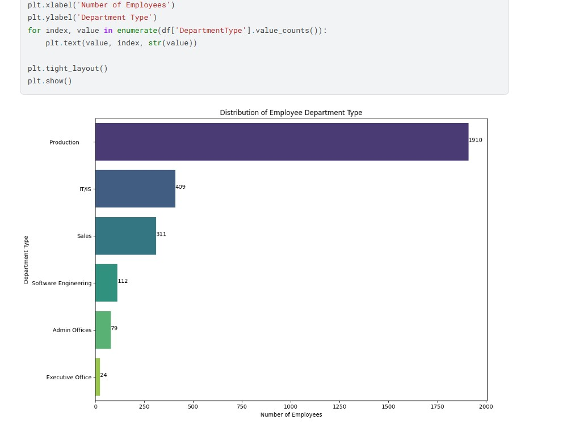
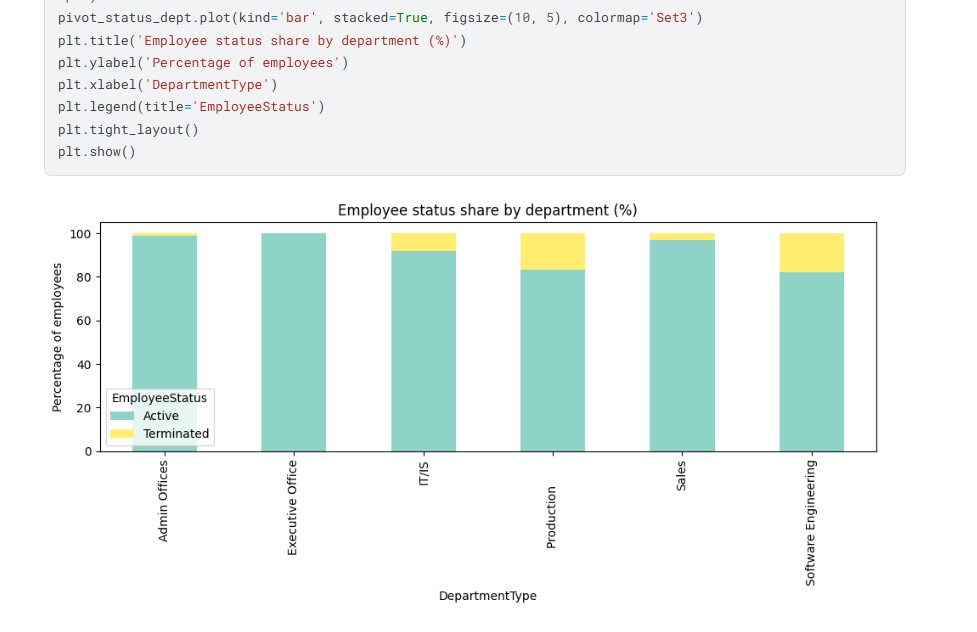
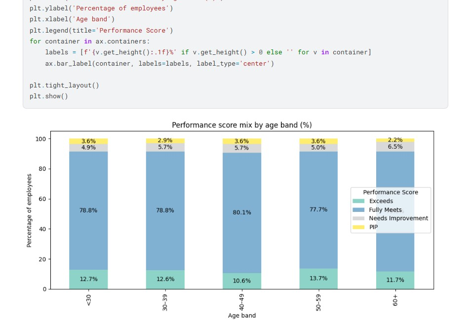
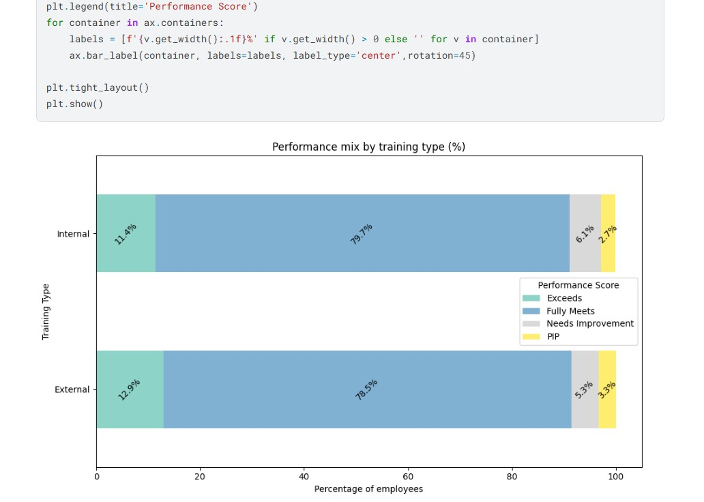

# HR Full Analysis - Comprehensive Human Resources Analytics Platform

HR Full Analysis is a comprehensive data analytics platform designed for in-depth human resources analysis leveraging data science, machine learning, and business intelligence techniques.

## Overview

HR Full Analysis aims to revolutionize HR decision-making by integrating cutting-edge technologies in data science, machine learning, and business intelligence. This platform provides tools for automated analysis, predictive modeling, and data-driven insights in HR scenarios, particularly focusing on employee retention, performance analysis, workforce optimization, and training effectiveness.

## Key Features

### Data Cleaning & Preparation
- **Comprehensive Data Validation**: Automated missing values detection and duplicate records identification
- **Feature Engineering**: Advanced date parsing, age band categorization, and employment year extraction
- **Data Quality Assurance**: Systematic data type conversion and data integrity checks

### Univariate Analysis
- **Demographic Insights**: Age distribution, gender balance, racial diversity, and marital status analysis
- **Employment Metrics**: Hiring trends over time, employee status distribution, and employment type analysis
- **Department & Division Analysis**: Comprehensive workforce distribution across organizational units
- **Geographic Analysis**: State-wise employee distribution and location-based insights
- **Performance Evaluation**: Employee rating distributions and performance score analysis

### Multivariate Analysis & Advanced Insights
- **Turnover Analysis**: Employee termination rates by department, business unit, division, and employee type
- **Performance Correlation**: Relationship between engagement, satisfaction, work-life balance, and performance
- **Training Effectiveness**: Impact of training programs on employee performance and outcomes
- **Demographic Performance Patterns**: Performance analysis across age bands, gender, race, and marital status
- **Compensation Analytics**: Pay zone performance correlation and salary band analysis
- **Job Title Performance**: Performance distribution across different roles and positions
- **Training ROI Analysis**: Cost-benefit analysis of training programs by outcome and type

### Interactive Visualizations
- Professional count plots and bar charts for categorical data
- Distribution histograms with KDE curves for continuous variables
- Stacked bar charts showing percentage distributions across categories
- Box plots for training cost analysis
- Time-series visualizations for temporal trends

### Business Intelligence Reporting
- Employee retention metrics by department and division
- Training program effectiveness measurement
- Engagement and satisfaction score analytics
- Performance benchmarking across organizational units

## Project Visualizations

### Organizational Headcount Distribution

*Visual representation showing the distribution of employees across different departments including Production, IT/IS, Sales, Software Engineering, Admin Offices, and Executive Office.*

### Employee Retention Analysis by Department

*Department-wise breakdown of Active vs Terminated employees, revealing IT/IS and Production departments have highest turnover rates (~10-15%)*
### Performance Score Distribution by Age Band

*Stacked bar chart analyzing performance ratings across five age groups, showing 40-49 age band achieves 80.1% "Fully Meets" performance*

### Training Effectiveness Comparison

*Horizontal stacked bars comparing Internal vs External training outcomes, showing External training achieves 12.8% "Exceeds" rate vs 11.4% Internal*
## Installation

To run HR Full Analysis locally, follow these steps:

1. Clone the repository:
   ```bash
   git clone https://github.com/AbdelrahmanGamal236/HR-Full_Analysis.git
   cd HR-Full_Analysis
   ```

2. Install required dependencies:
   ```bash
   pip install pandas numpy matplotlib seaborn jupyter
   ```

3. Launch the Jupyter notebook:
   ```bash
   jupyter notebook hr-full-analysis.ipynb
   ```

4. Open your web browser and navigate to the Jupyter interface to access the comprehensive analysis.

## Usage

### Data Loading
- Load HR datasets from Kaggle or local sources
- Automatic data type detection and conversion
- Support for multiple date formats

### Analysis Execution
- **Univariate Analysis**: Explore individual variables and their distributions
- **Bivariate Analysis**: Examine relationships between two variables
- **Multivariate Analysis**: Uncover complex patterns across multiple dimensions
- **Statistical Summaries**: Generate descriptive statistics for all metrics

### Insights Generation
- Employee turnover risk identification
- Training program effectiveness evaluation
- Performance improvement recommendations
- Workforce planning insights

### Reporting & Export
- Generate professional visualizations for stakeholder presentations
- Export analysis results in multiple formats
- Create executive summary reports

## Technologies Used

- **Python 3.x**: Primary programming language for data analysis
- **Pandas**: Advanced data manipulation and analysis
- **NumPy**: Numerical computing and array operations
- **Matplotlib**: Publication-quality data visualizations
- **Seaborn**: Statistical data visualization with enhanced aesthetics
- **Jupyter Notebook**: Interactive development and documentation environment

## Dataset Information

The analysis uses an HR analytics dataset containing:
- **2,845 employee records**
- **28 comprehensive features** including:
  - Employee demographics (age, gender, race, marital status)
  - Employment details (title, department, division, business unit)
  - Performance metrics (ratings, scores, engagement levels)
  - Training information (programs, outcomes, costs, duration)
  - Survey data (engagement, satisfaction, work-life balance)

## Key Insights

The analysis reveals critical HR insights such as:
- Identification of departments with highest turnover rates
- Correlation between training outcomes and performance
- Employee engagement drivers across different demographics
- Optimal training program characteristics for maximum effectiveness
- Performance patterns across age groups and employment types

## Contributing

Contributions are welcome! If you'd like to contribute to HR Full Analysis, please follow these steps:

1. Fork the repository and create your branch from `main`
2. Make your changes and ensure code quality and documentation standards
3. Test your changes thoroughly with sample datasets
4. Submit a pull request with a detailed description of your changes and their purpose

## Contact

For inquiries about HR Full Analysis and its applications, please contact:

- **Email**: [Abdelrahman.Gamal.Ai@gmail.com](mailto:Abdelrahman.Gamal.Ai@gmail.com)
- **LinkedIn**: [linkedin.com/in/abdelrahman-gamal236](https://www.linkedin.com/in/abdelrahman-gamal236/)
- **WhatsApp**: +201029744194
- **GitHub**: [@AbdelrahmanGamal236](https://github.com/AbdelrahmanGamal236)

---

© 2026 Abdelrahman Gamal. All Rights Reserved.
